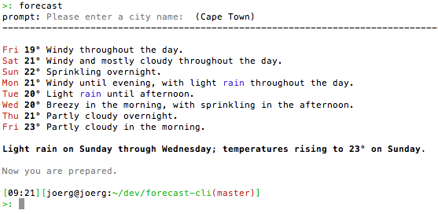
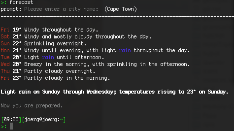

forecast-cli
============

forecast-cli is a node.js module and CLI tool for getting a weather forecast using [forecast.io](http://forecast.io)'s API. It uses Degrees Celsius.

Installation
------------

With [npm](http://github.com/isaacs/npm):

    npm install -g forecast-cli
  
Clone this project:

    git clone http://github.com/joergd/forecast-cli.git

CLI
---

  Usage: forecast [options] [placename]

  Options:

    --hourly       Hourly report for the next 48 hours
    -h, --help     output usage information
    -V, --version  output the version number

  Examples:

    $ forecast
    $ forecast "Cape Town"
    $ forecast --hourly "Cape Town"

Default place name
------------------

Your last placename will be stored in 

    ~/.forecast-cli.json

White screenshot
----------------

Black screenshot
----------------

----------------

Now you're prepared.
